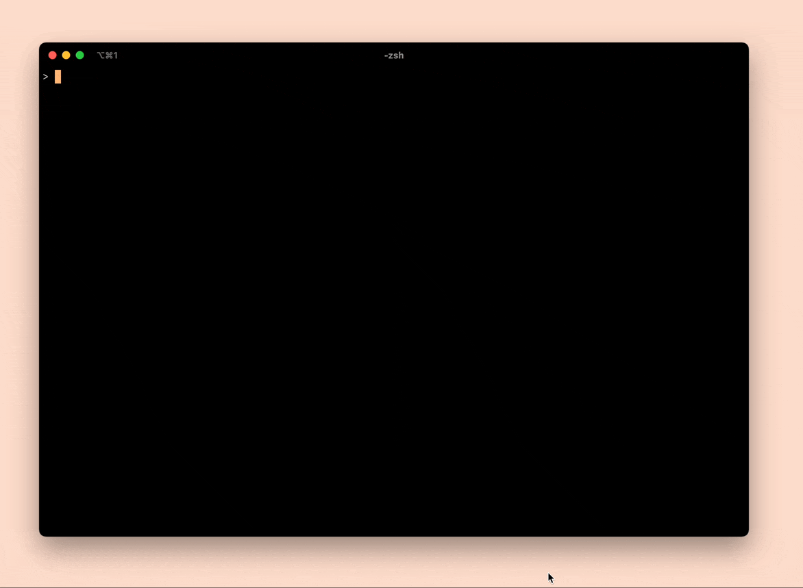

# 04 Scanning -- notes

## Notes on the implementation
At this point, our interpreter `jlox` is a program that executes the main function in `Lox.java`. The interpreter simply prints the list of tokens that were scanned from the input stream.

`jlox` can either be run on its own with no arguments, or it can be passed a path to a file.
- When it is run with no arguments, `jlox` runs in an infinite loop reading a line from `stdin` and outputting the tokens from that line on `stdout`.
- When it is run with the path to a file as an argument, `jlox` reads the entire file and prints the list of tokens from that file on `stdout`.

### What does `Lox.java` do?
`Lox.java` contains the entry point for our interpreter. This class is responsible for parsing the command line arguments, reading the program source and calling the scanner. It does so in the following way:
1. `main()` parses the arguments and either calls `runFile()` if a file path was passed as an argument or `runPrompt()` if no file path was given.
2. These two functions each get a string of program source and call `run()` with that string:
  - `runFile()` gets the source read the entire file and construct a string from that files contents
  - `runPrompt()` gets a line of source code from `stdin`
3. `run()` creates a new `Scanner` object with that source string, then it calls `scanTokens()` to get the tokens for that source.
4. Next `run()` prints all of those tokens

### What does the `Scanner` class do?
`Scanner` is a class that is used to process the raw input source string and generate a list of tokens from that source. After initializing a `Scanner` object, the caller can generate a list of tokens by calling `scanTokens()` on that object.

`Scanner` stores a copy of the input program source string in it's instance variable `source` and it also stores a list of the scanned tokens in the instance variable `tokens`.

To facilitate the scanning, `Scanner` uses two index pointers into the source string (`start` and `current`). When the caller calls `scanTokens()`, the class moves these two pointers forward over the entire input string. Both `start` and `variable` are set to the start of the next unprocessed character sin the input string each time that the internal method `scanToken()` is called.

`scanToken()` evaluates the character pointed to by `current` trying to make a token. `sanToken()` keeps moving `current` forward until a complete token is found. That token is then added to the `tokens` instance variable.

### What does the `Token` class do?
The `Token` class simply defines an object that stores data for the tokens that have been read. The data in a token includes the `lexeme` instance variable (the sub string from our input source for this string), the `tokenType` for this token, and the `literal` value of that token (for tokens like strings and numbers that have a literal value).

## Thoughts on the implementation so far
The scanner class requires about twice as much memory as our source input string. Scanner stores the entire input string as well as the entire list of tokens that were extracted from that source.
- I think that is just sort of inherent to how the compiler works. You always probably need at least 2n the input size of your program in memory.
- each transformation in the compiler more or less needs to hold the entire input form and the entire newly transformed version of the program data.

This implementation of the scanner does not allow escaping characters in string literals.
- For example, there is no way to have a string with a `"` character in it.
- I think that this type of behavior would need to be implemented in scanner itself.
- It would be as easy as changing the logic in the scanner's `string()` function to notice an escape character `\`, remove that from the token and then not treat the following `"` as semantically significant.

Tokens store both the data for the thing we parsed and the lexeme itself. So for a number token, we are storing both the string from the input as well as the interpreted number for that input.
- This is a small amount of duplicated data in the grand scheme of the program.
- We are probably implementing it this way for error reporting. Suppose we extended the interpreter to support writing number literals in hex (for example `"0x6AF1"`), then if we only stored the literal value, we could not show the user the specific numeric literal they wrote in any sort of error message.

I don't love the naming in the scanner thus far. I would have probably named the pointers something different. Maybe `lexemeStartSourceIndex` and `lexemeNextSourceIndex` or something like that. Similarly, I found the naming of the functions `advance()` `peek()` `peekNext()` somewhat confusing.

This scanner parses the input string as `UTF-8` characters. This is because we are using the default character encoding from java. If we wanted to support a different kind of character set, the scanner is where we would need to implement that.
