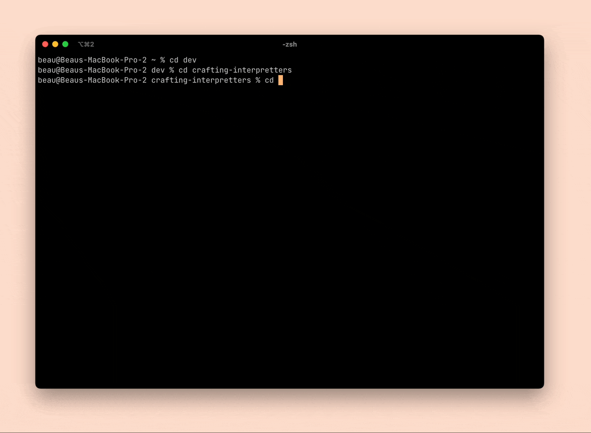

# Chapter 05: Representing Code
In this chapter, we create classes which represent the structure of our programming language. We create a program (`./tool/GenerateAst.java`) that will generate a set of classes that represent the abstract syntax tree for our program.

We also setup these classes we generate to use the visitor pattern. This pattern is quite confusing to me... but basically, it allows you to create new functionality for an entire set of classes without needing to implement functionality within those classes.

This is demonstrated with the program `./jlox_src/AstPrinter.java` which implements the functionality to print each expression in the abstract syntax tree. So that there is an observable artifact from this chapter, we also add a small test abstract syntax tree in `AstPrinter.java` and create a main function that will print it.



## Code Pointers
This chapter introduces two main files

### `./tool/GenerateAst.java`
This file generates a file called `Expr.java`. The program generates a list of classes based on a grammar that is defined statically in the program. At this point in the program, the grammar that is being used is as follows:

```java
 defineAst(outputDir, "Expr", Arrays.asList(
            "Binary   : Expr left, Token operator, Expr right",
            "Grouping : Expr expression",
            "Literal  : Object value",
            "Unary    : Token operator, Expr right"
        ));
```

The Ast generator creates a list or classes from this grammar such that we get one class for each non-terminal that holds data for the right-hand side of each expression.

We also setup each class to use the visitor pattern such such that we can implement new operations on each of the expression types that we generate.

### `./jlox_src/AstPrinter.java`

In this chapter, we build one bit of functionality that showcases the visitor pattern. We implement a print function for each of the classes in the expression grammar.

This class showcases the functionality of the visitor pattern because we can easily add new behavior to each of the classes in the system. In this case, the Ast printer class shows how we can effectively implement a `print()` operation on each abstract syntax tree node class without explicitly adding a new operation on each class.

## Thoughts on the implementation so far
- The visitor pattern is messy.
  - I have a really hard time grokking the visitor pattern... partially, because this is something that is just so easy to implement in a slightly more functional language.
  - In a language like typescript or rust, it so so much easier to define types of data and create functions that enumerate over each of the variants of those functions.
- Meta-programming is neat!
  - I am not very experienced with writing programs that write programs. Maybe it is just because it is a tool I am not as familiar with.
  - This use-case -- generating classes from a grammar -- is particularly well suited to the tool.
