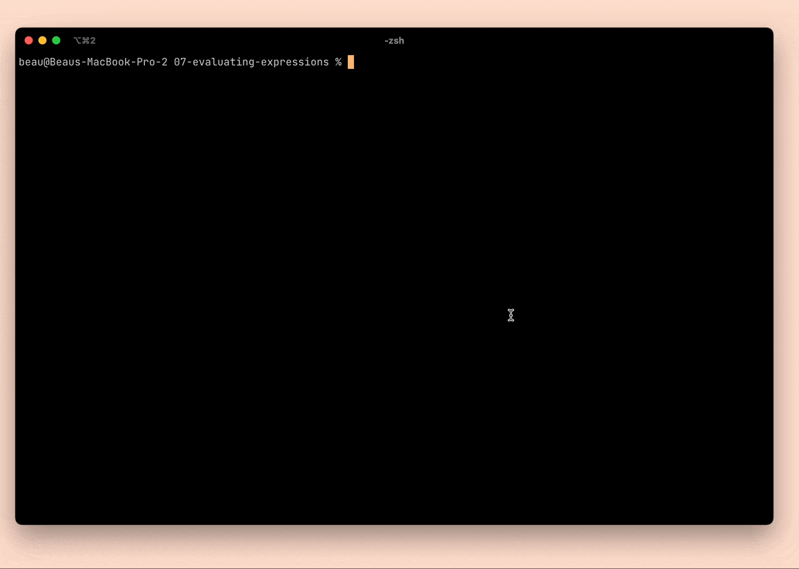

# Chapter 07: Evaluating Expressions
In this chapter, we build an interpreter for the literal expressions in our language!

## Visiting Nodes in our AST
At this point, we make a new visitor for the expression nodes in our abstract syntax tree. This visitor evaluates each node's children and produces a value based on those children.

Depending on the types of nodes in our ast, our interpreter will either produce a new value from those nodes, or it will evaluate to a new value.

## Dynamic type system
This interpreter implements very light weight dynamic typing into the interpreter. We do checks against the values in our nodes and the operator in the node to see if they are a valid operation. This happens because our nodes are defined with the type `Object` for every node. Of course we know that the literal values in our AST are actually values like `String` or `double`, so we can downcast these values to a simpler type.

Our lox implementation has
- the following types for literal values: `boolean`, `double` and `string`.
- the following operations on those types:
  - comparisons: `> >= < <=`
  - equality: `!= ==`
  - negation: `!`
  - arithmetic: `+ - * /`
  - string concatenation: `+`

Not all operations work on all types though:
  - comparison operations only work when both operands are `double`
  - arithmetic operations only work when both operands are `double`
  - string concatenation only works when both operands are `string`
  - equality works on all types on both sides
  - bang works on all types

_It is interesting to note that string concatenations and arithmetic addition both have the same operator symbol. But they are in fact different operations._

## Reflections
- We are missing a few different operator types I would expect like the logical boolean operators `&&` and `||`
- Even in this dynamic languages, some of these checks for expressions could be handled in the parser. Especially at this point, we could have encoded which literal values are allowed on which side of operators into our grammar
  - But, I see why we didn't do that. Because we implemented this value and type checking in the interpreter itself, we do not have to iterate our grammar every time we want to add a new operator.
- Thinking about ast visitors in general, prettier is an interesting example of something you can do with an ast. Prettier is a program that produces the ast for your language, and then re-prints your program based on that ast. It essentially runs the parser and scanner in reverse.
- Really curious how other people building this interpreter in a different language are dealing withe the literals that are a generic object type? How are they representing the literals in their nodes? As a compound type?