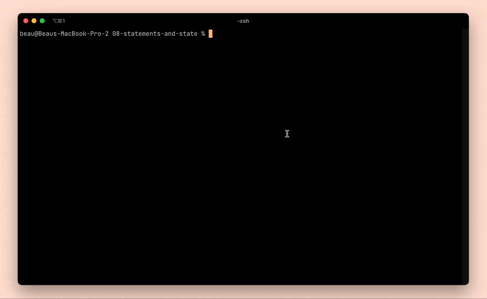
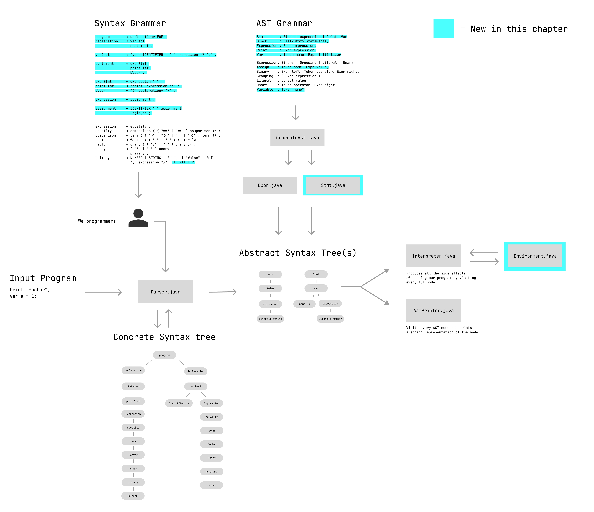

# Chapter 08: Statements and State
_(this was a beefy chapter... adding lots of new functionality)_ In this chapter, we introduce statements, variables, and scope to our program.

We begin the chapter by introducing simple expression statements and print statements. We then move on to introduce global variable declarations and variable expressions. This allows us to create top level variables in our language and allows us to reference those variables in our expressions. To support these global variables, we also include an `environment` object in our interpreter. This `environment` object is a map containing all of the global variables and their values.

We then move on to introduce block statements and nested environments. These allow us to build basic block scoping to our programs.

## Diagram overview of interpreter up to this point
__additions in this chapter are highlighted in light blue__

## Notes on changes in this chapter

**8.1 Statements**
- add a new statement AST node type
    - start with expression statements and print statements
    - add new syntax rules
- change interpreter from accepting expressions to list of statements rather than an expression

**8.2 Global Variables**
- add a new variable declaration statement
  - in the syntax grammar, we make declarations a lower precedence kind of statement than
    expr statements and print statements...
  - the reason for this is that in the future, there will be syntactic structures for which we want to include
    a statement as a sub-item, but not a variable declaration.
  - To be clear though, we don't make use of this functionality in this chapter. Every place we are using a statement,
    we also use a declaration.
- add a new variable expression value
  - this gets added as a new primary value (`IDENTIFIER`) in our concrete syntax tree 
  - and in our abstract syntax tree node definitions, this gets added as new expression node
- It is worth emphasizing that declarations do not make it into our abstract syntax tree, they only exist on the concrete syntax tree.
  - Our abstract syntax tree only contains a statement node, and that statement node can be var statement.

**8.3 Environments**
- create a new environment class that is essentially a map of strings to objects. The strings are the variable names and the objects are the values
- We update the interpreter's visitors for var declaration statements and for variable expression statements.
- The way we implement these visitors defines the variable semantics for our language
    - a declaration without an initializer (`var a;`) assigns a to `null`.
    - a variable expression referencing a variable name before its declaration is a runtime error
    - re-declaring a variable is not a runtime error

**8.4 Assignment syntax**
- We introduce a new assignment expression type into our concrete syntax grammar and our abstract syntax grammar.
- In our syntax grammar:
  - an assignment is the lowest priority assignment type
  - the left hand side of the the assignment must evaluate to a variable expression
  - the right hand side of the assignment must evaluate to an expression
- In our abstract syntax tree
  - evaluating an assignment expression will assign the new value to the variable
  - the whole expression will evaluate to the new value

**8.5 Scope**
- In order to support variable scopes, we first make our environments a nested structure such that each environment has a parent environment it can also reference.
  - using this new parent environment, each variable lookup can fist look at the current environment, then look at the enclosing environment if the symbol
  is not found in the current environment.
  - the global scope should be the only environment that does not have a parent wrapping environment.
- We also need a syntactic structure that will allow us to execute certain statements with one scope and certain statements with a different scope.
  - We implement this by creating a `block` statement type that is a wrapper around a list of declarations
  - We also create a block AST node that contains a list of statements to execute
- When we visit the block abstract syntax tree node we create a new environment which has a parent environment created from the current environment.
  - once we are executing the statements in that block, we set the global environment value to the blocks new environment.
  - once we finish executing the statement, we set the environment back to the current value.

## Reflections
- Some programming languages populate the global scope with values. What do you call that? Is that part of the language specification or is that part of the runtime environment? 
- In javascript:
  - your global scope includes all of the keys on a global object. In the browser, this will be the `window` object, or a `WorkerGlobalScope` object depending on how the code was initialized. Node defines it's own global scope object.
  - There are some wacky things on the global scope in javascript.
    - for example, values like `undefined` and `NaN` are keys in that global scope object.
    - built-in functions like `alert` and `parseInt` are also defined on the global object
  - An EcmaScript compliant implementation must include [the following properties](https://tc39.es/ecma262/multipage/global-object.html) in it's global scope.
- Other languages:
  - Other languages have a similar setup, requiring certain global values (the standard library) to be exposed in global scope, and allowing different implementations of the language to include their own properties, functions and prototypes in the global scope.
- Your language's standard library may or may not live entirely in global scope
  - in javascript, the entire standard library is included in global scope
  - in java, some values like `System` are included in global scope, while other values in the standard library must be imported (like `import java.util.ArrayList`)
- When you import values in languages, you are adding a new (typically read only) value to your current scope
- Javascript has a global scope and a module scope
  - if your code is running in a module, the only way to get a value into global scope is to write it to the window object
- Javascript also has the concept of hoisting variable declarations, so certain declarations are hoisted into the top of your scope before execution begins

